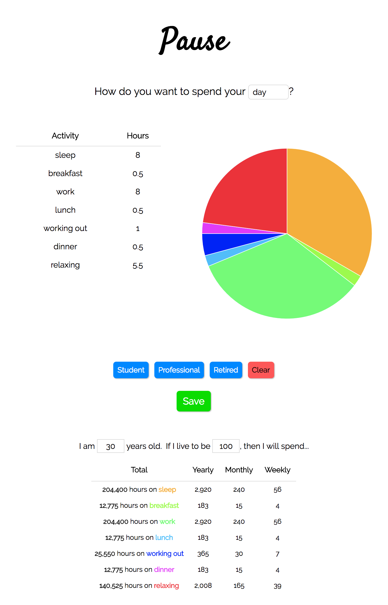

# Pause

Pause is a [React](https://reactjs.org/) web app that allows you to plan your day, week or month and visually display each day's breakdown of 24 hours in a chart generated with [React-ChartJS-2](http://jerairrest.github.io/react-chartjs-2/). You can enter any activities you would like in a table, including the activity name and the number of hours you would like to dedicate to that activity. Each chart updates dynamically whenever you add, delete, or update an activity. You can toggle between different chart types (pie, bar, radar, doughnut) to visualize your data in different ways. Chart color palettes are generated randomly with a modified version of [PleaseJS](https://github.com/Fooidge/PleaseJS). A table beneath the chart calculates how many hours you will spend on each activity weekly, monthly, and yearly, as well as how many hours you will spend on each activity in your remaining lifespan based on your current age and your specified ending age. If you are not sure which activities to start with, you can click one of the starter buttons to display activities for common lifestyles. You can store your activities using an [API](https://github.com/estherh5/pause_api), which generates a unique external identifier that you can use to access your activities in a URL (i.e., `https://pause.crystalprism.io/<external_id>`), allowing you to revisit them and share them with others.

## Setup
1. Clone this repository locally or on your server.
2. Go to the project root directory, and install the required dependencies by running `npm install`.
3. Compile the required stylesheets and scripts by running `npm run build`.
