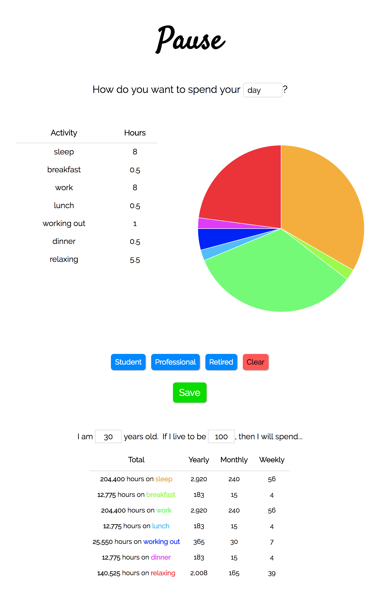

# Pause



Pause is a React app for planning how to spend a day, week, or month. Activities
are displayed in editable tables and Chart.js visualizations, with optional
shareable links backed by the Pause API.

## Development

Requirements:

- Node.js 22 or newer
- npm 10 or newer

Install dependencies and start the Vite development server:

```sh
npm install
npm run dev
```

The local app uses `http://localhost:5000/api` by default. To point it at a
different API, set `VITE_API_URL`.

## Checks

```sh
npm test
npm run lint
npm run build
```

To inspect the production build locally:

```sh
npm run preview
```
